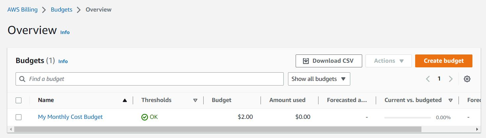
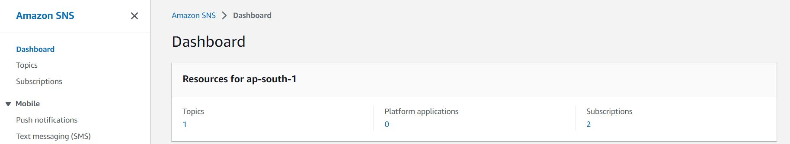
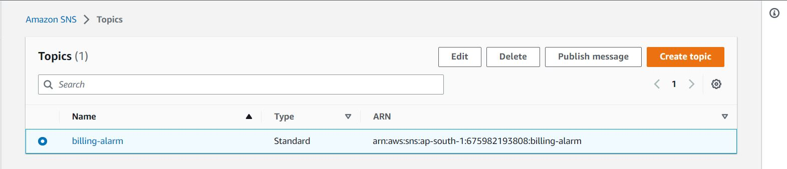
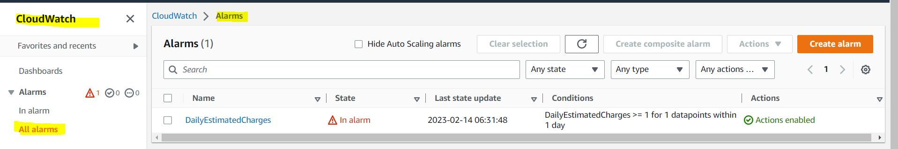
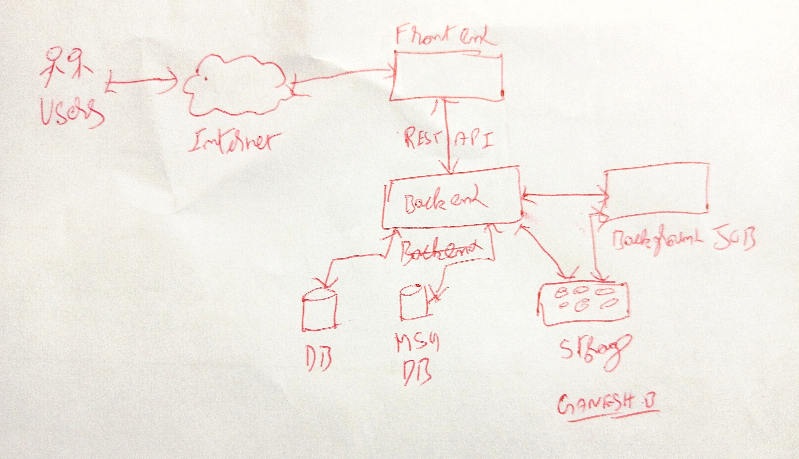
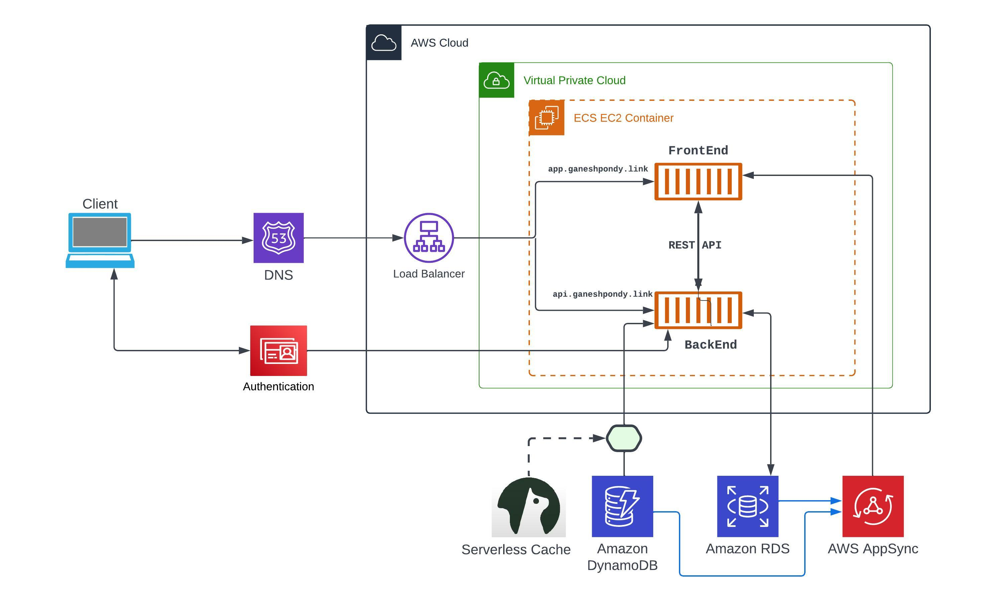
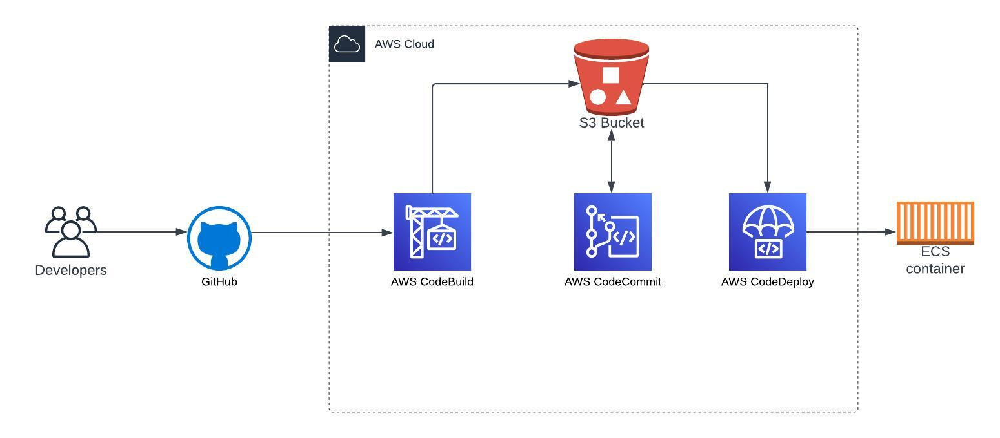

# Week 0 — Billing and Architecture

## 1. AWS User

Root Account should not be used for Regular Operations and Security Reasons. So, we have Separate Account Created for All Operations and Download the Access Key ID and SECRET ACCESS KEY Details.

## 2. AWS CLI

Connecting CloudShell to execute and Test AWS CLI Commands and get familiar ourselves will AWS Commands


```YAML
CLOUDSHELL OUTPUTS
--------------------

[cloudshell-user@ip-IPDetail ~]$ aws --cli-auto-prompt 
> aws sts get-caller-identity
{
    "UserId": "",
    "Account": "",
    "Arn": "arn:aws:iam:::user/"
}

[cloudshell-user@ip-IPDetail ~]$ aws account get-contact-information
{
    "ContactInformation": {
        "AddressLine1": ",",
        "AddressLine2": " ,",
        "City": "",
        "CountryCode": "",
        "FullName": "",
        "PhoneNumber": "",
        "PostalCode": "",
        "StateOrRegion": ""
    }
}
[cloudshell-user@ip-IPDetail ~]$ 
```

Connecting GitPod to access the GitHub Codes and Installed AWS CLI in GitPod and Exported AWS Account Details as Global Environment Variables

Added Following Lines in ".gitpod.yml" file to install AWS in GitPod

```YAML
tasks:
  - name: aws-cli
    env:
      AWS_CLI_AUTO_PROMPT: on-partial
    init: |
      cd /workspace
      curl "https://awscli.amazonaws.com/awscli-exe-linux-x86_64.zip" -o "awscliv2.zip"
      unzip awscliv2.zip
      sudo ./aws/install
      cd $THEIA_WORKSPACE_ROOT
```
Below Commands are used to Exporting AWS Credentials as Goble Environment Variables
```BASH
gitpod /workspace $ export AWS_ACCESS_KEY_ID=""
gitpod /workspace $ export AWS_SECRET_ACCESS_KEY=""
gitpod /workspace $ export AWS_DEFAULT_REGION="ap-south-1"

gitpod /workspace $ env | grep -i aws_
AWS_DEFAULT_REGION=ap-south-1
AWS_SECRET_ACCESS_KEY=
AWS_ACCESS_KEY_ID=

gitpod /workspace $ aws sts get-caller-identity
{
    "UserId": "",
    "Account": "",
    "Arn": "arn:aws:iam:::user/"
}
gitpod /workspace $ 
```

To Permentally Export the Variables in GitPod Profile.

```BASH
gp env AWS_ACCESS_KEY_ID=""
gp env AWS_SECRET_ACCESS_KEY=""
gp env AWS_DEFAULT_REGION="ap-south-1"
gp env AWS_ACCOUNT_ID=""
```


## 3. Configuring Budget alerts

1. Create Diredtory "aws/json/" Under [aws-bootcamp-cruddur-2023](https://github.com/ganeshpondy/aws-bootcamp-cruddur-2023 "github.com/ganeshpondy/aws-bootcamp-cruddur-2023") Repo.

2. Update below two Files
    budget-notifications-with-subscribers.json
    budget.json

```javascript
aws budgets create-budget \
    --account-id $AWS_ACCOUNT_ID \
    --budget file://aws/json/budget.json \
    --notifications-with-subscribers file://aws/json/budget-notifications-with-subscribers.json
```



## 4. Creating sns topics for alerts
1. Create Topic

```javascript
gitpod /workspace/aws-bootcamp-cruddur-2023 (main) $ aws sns create-topic --name billing-alarm
{
    "TopicArn": "arn:aws:sns:ap-south-1:id:billing-alarm"
} 
```



2. subscribe SNS with the Topic arn id
```
gitpod /workspace/aws-bootcamp-cruddur-2023 (main) $ aws sns subscribe \
>     --topic-arn arn:aws:sns:ap-south-1:id:billing-alarm \
>     --protocol email \
>     --notification-endpoint mail@gmail.com
{
    "SubscriptionArn": "pending confirmation"
}
```


## 5. Creating cloudwatch Alarms through alarm-config.json file

```javascript
aws cloudwatch put-metric-alarm --cli-input-json file://aws/json/alarm-config.json
```



# 6. Logical Diagram for the Cruddur Application



# 7. Conceptual Chart



[Conceptual Chart LucidChart Link](https://lucid.app/lucidchart/9568f89a-ebb8-4f91-b096-5aedf2614f42/edit?invitationId=inv_4361516c-c455-4f36-b78a-1dbb3fe6f548)

# 8. CI CD Flow Diagram



[CICD FLow LucidChart Link](https://lucid.app/lucidchart/dcf4deff-2518-40c6-8dc1-399bc17ad858/edit?invitationId=inv_5510c85d-8dd4-4aa6-b27e-70bbbbdde270)

