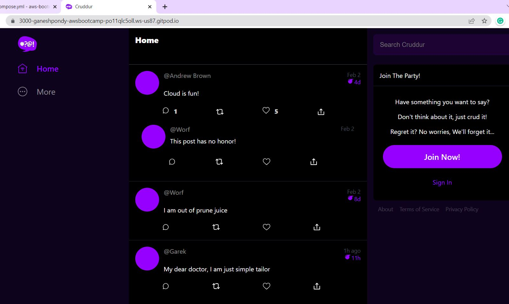
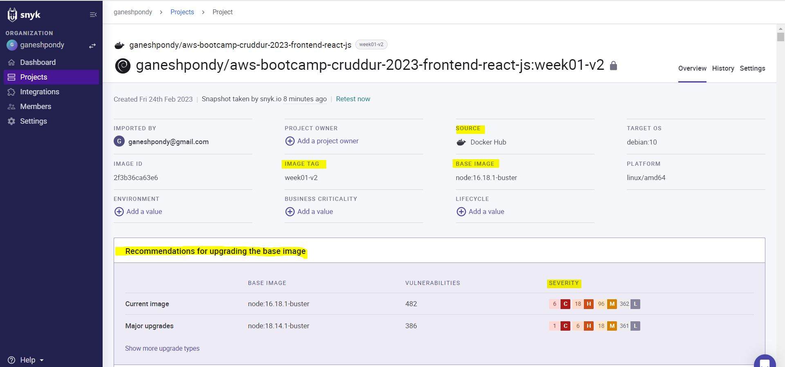

# Week 01 — App Containerization
## 01. Docker Files

Connect GitPod Enviroment. 

Go to frontend-react-js Directory and Install npm. npm is a package manager for the JavaScript.

```BASH

cd frontend-react-js
npm i
```

Create Docker files for Frontend and Backend Application to run in Containers.

FrontEnd Docker File

```aws-bootcamp-cruddur-2023/frontend-react-js/Dockerfile```
```DOCKER
FROM node:16.18

ENV PORT=3000

COPY . /frontend-react-js
WORKDIR /frontend-react-js
RUN npm install
EXPOSE ${PORT}
CMD ["npm", "start"]

```

### Build Container

```BASH
docker build -t  frontend-react-js ./frontend-react-js
```
<!-- -->

### Run Docker
```DOCKER
docker run -p 3000:3000 -d frontend-react-js
```

BackEnd Docker File Path:

```./aws-bootcamp-cruddur-2023/backend-flask/Dockerfile```

BackEnd Docker File

```DOCKER
FROM python:3.10-slim-buster

# Inside Container
# make a new folder inside Container
WORKDIR /backend-flask

# Outside Container ==> Inside Container
# this contains the libraries want to install to run the application
COPY requirements.txt requirements.txt

# Inside Container
# Install the python libraries used for the app
RUN pip3 install -r requirements.txt

# Outside Container ==> Inside Container
# (.) ==> means Everything in the current directory, Copy Everything
# first period . - /backend-flask (outside container)
# second period . /backend-flask (inside container)
COPY . .

# Set Enviroment Variables (Env Vars)
# Inside Container and wil remain set when the container is running.
ENV FLASK_ENV=development

EXPOSE ${PORT}

# CMD (Command)
# python3 -m flask run --host=0.0.0.0 --port=4567
# 
CMD [ "python3", "-m" , "flask", "run", "--host=0.0.0.0", "--port=4567"]
```

### Build Container
```
docker build -t  backend-flask ./backend-flask
```
### Run Docker
```DOCKER
docker run --rm -p 4567:4567 -it -e FRONTEND_URL='*' -e BACKEND_URL='*' backend-flask
#run docker in Detached Mode
docker run --rm -p 4567:4567 -d -e FRONTEND_URL='*' -e BACKEND_URL='*'backend-flask
```


### Adding DynamoDB Local and Postgres

Create a table
```
aws dynamodb create-table \
    --endpoint-url http://localhost:8000 \
    --table-name Music \
    --attribute-definitions \
        AttributeName=Artist,AttributeType=S \
        AttributeName=SongTitle,AttributeType=S \
    --key-schema AttributeName=Artist,KeyType=HASH AttributeName=SongTitle,KeyType=RANGE \
    --provisioned-throughput ReadCapacityUnits=1,WriteCapacityUnits=1 \
    --table-class STANDARD
```

Create an Item
```
aws dynamodb put-item \
    --endpoint-url http://localhost:8000 \
    --table-name Music \
    --item \
        '{"Artist": {"S": "No One You Know"}, "SongTitle": {"S": "Call Me Today"}, "AlbumTitle": {"S": "Somewhat Famous"}}' \
    --return-consumed-capacity TOTAL  
```
<!--
```YAML
gitpod /workspace/aws-bootcamp-cruddur-2023 (main) $ aws dynamodb create-table \
>     --endpoint-url http://localhost:8000 \
>     --table-name Music \
>     --attribute-definitions \
>         AttributeName=Artist,AttributeType=S \
>         AttributeName=SongTitle,AttributeType=S \
>     --key-schema AttributeName=Artist,KeyType=HASH AttributeName=SongTitle,KeyType=RANGE \
>     --provisioned-throughput ReadCapacityUnits=1,WriteCapacityUnits=1 \
>     --table-class STANDARD
{
    "TableDescription": {
        "AttributeDefinitions": [
            {
                "AttributeName": "Artist",
                "AttributeType": "S"
            },
            {
                "AttributeName": "SongTitle",
                "AttributeType": "S"
            }
        ],
        "TableName": "Music",
        "KeySchema": [
            {
                "AttributeName": "Artist",
                "KeyType": "HASH"
            },
            {
                "AttributeName": "SongTitle",
                "KeyType": "RANGE"
            }
        ],
        "TableStatus": "ACTIVE",
        "CreationDateTime": "2023-02-20T15:00:52.972000+00:00",
        "ProvisionedThroughput": {
            "LastIncreaseDateTime": "1970-01-01T00:00:00+00:00",
            "LastDecreaseDateTime": "1970-01-01T00:00:00+00:00",
            "NumberOfDecreasesToday": 0,
            "ReadCapacityUnits": 1,
            "WriteCapacityUnits": 1
        },
        "TableSizeBytes": 0,
        "ItemCount": 0,
        "TableArn": "arn:aws:dynamodb:ddblocal:000000000000:table/Music"
    }
}

```

```YAML
gitpod /workspace/aws-bootcamp-cruddur-2023 (main) $ aws dynamodb put-item \
>     --endpoint-url http://localhost:8000 \
>     --table-name Music \
>     --item \
>         '{"Artist": {"S": "No One You Know"}, "SongTitle": {"S": "Call Me Today"}, "AlbumTitle": {"S": "Somewhat Famous"}}' \
>     --return-consumed-capacity TOTAL  
{
    "ConsumedCapacity": {
        "TableName": "Music",
        "CapacityUnits": 1.0
    }
}
```
-->
List Tables

```
aws dynamodb list-tables --endpoint-url http://localhost:8000
```
<!--
```YAML
gitpod /workspace/aws-bootcamp-cruddur-2023 (main) $ aws dynamodb list-tables --endpoint-url http://localhost:8000
{
    "TableNames": [
        "Music"
    ]
}

```
-->
Get Records
```
aws dynamodb scan --table-name Music --query "Items" --endpoint-url http://localhost:8000

```
<!--
```YAML
gitpod /workspace/aws-bootcamp-cruddur-2023 (main) $ aws dynamodb scan --table-name Music --query "Items" --endpoint-url http://localhost:8000
[
    {
        "Artist": {
            "S": "No One You Know"
        },
        "SongTitle": {
            "S": "Call Me Today"
        },
        "AlbumTitle": {
            "S": "Somewhat Famous"
        }
    }
]
gitpod /workspace/aws-bootcamp-cruddur-2023 (main) $ 
```
-->
Add in gitpod.yml to install postgres client

``` 
psql -U postgres --host localhost
```
```YAML
gitpod /workspace/aws-bootcamp-cruddur-2023 (main) $ psql -U postgres --host localhost 
Password for user postgres: p
psql (13.10 (Ubuntu 13.10-1.pgdg20.04+1))
Type "help" for help.

postgres=# 
postgres-# \dl
      Large objects
 ID | Owner | Description 
----+-------+-------------
(0 rows)

postgres-# \l
 postgres  | postgres | UTF8     | en_US.utf8 | en_US.utf8 | 
 template0 | postgres | UTF8     | en_US.utf8 | en_US.utf8 | =c/postgres          +
           |          |          |            |            | postgres=CTc/postgres
 template1 | postgres | UTF8     | en_US.utf8 | en_US.utf8 | =c/postgres          +
           |          |          |            |            | postgres=CTc/postgres

postgres-# 

postgres-# \q
gitpod /workspace/aws-bootcamp-cruddur-2023 (main) $ 
```

## 02. Multiple Containers
#### Docker Compose File

Create docker-compose.yml with the folowing Details:

```DOCKER
version: "3.8"
services:
  backend-flask:
    environment:
      FRONTEND_URL: "https://3000-${GITPOD_WORKSPACE_ID}.${GITPOD_WORKSPACE_CLUSTER_HOST}"
      BACKEND_URL: "https://4567-${GITPOD_WORKSPACE_ID}.${GITPOD_WORKSPACE_CLUSTER_HOST}"
    build: ./backend-flask
    ports:
      - "4567:4567"
    volumes:
      - ./backend-flask:/backend-flask

  frontend-react-js:
    environment:
      REACT_APP_BACKEND_URL: "https://4567-${GITPOD_WORKSPACE_ID}.${GITPOD_WORKSPACE_CLUSTER_HOST}"
    build: ./frontend-react-js
    ports:
      - "3000:3000"
    volumes:
      - ./frontend-react-js:/frontend-react-js
    #Health Check Steps
    healthcheck:
      test: ["CMD-SHELL", "curl -f http://localhost:3000 || exit 1"]
      interval: 1m30s
      timeout: 10s
      retries: 3
      start_period: 20s

  dynamodb-local:
    # We want to add user:root to get this working.
    user: root
    command: "-jar DynamoDBLocal.jar -sharedDb -dbPath ./data"
    image: "amazon/dynamodb-local:latest"
    container_name: dynamodb-local
    ports:
      - "8000:8000"
    volumes:
      - "./docker/dynamodb:/home/dynamodblocal/data"
    working_dir: /home/dynamodblocal
  db:
    image: postgres:13-alpine
    restart: always
    environment:
      - POSTGRES_USER=postgres
      - POSTGRES_PASSWORD=password
    ports:
      - '5432:5432'
    volumes: 
      - db:/var/lib/postgresql/data

# the name flag is a hack to change the default prepend folder and name when outputting the image names
networks: 
  internal-network:
    driver: bridge
    name: cruddur

volumes:
  db:
    driver: local
```


<!--
### docker-compose Containers Running
```DOCKER
gitpod /workspace/aws-bootcamp-cruddur-2023 (main) $ docker ps
CONTAINER ID   IMAGE                                         COMMAND                  CREATED         STATUS         PORTS                                       NAMES
20ebafb0ce67   aws-bootcamp-cruddur-2023-backend-flask       "python3 -m flask ru…"   2 minutes ago   Up 2 minutes   0.0.0.0:4567->4567/tcp, :::4567->4567/tcp   aws-bootcamp-cruddur-2023-backend-flask-1
4128217357cc   aws-bootcamp-cruddur-2023-frontend-react-js   "docker-entrypoint.s…"   2 minutes ago   Up 2 minutes   0.0.0.0:3000->3000/tcp, :::3000->3000/tcp   aws-bootcamp-cruddur-2023-frontend-react-js-1
0f3ae5c1f5b3   postgres:13-alpine                            "docker-entrypoint.s…"   2 minutes ago   Up 2 minutes   0.0.0.0:5432->5432/tcp, :::5432->5432/tcp   aws-bootcamp-cruddur-2023-db-1
e12dce8f7666   amazon/dynamodb-local:latest                  "java -jar DynamoDBL…"   2 minutes ago   Up 2 minutes   0.0.0.0:8000->8000/tcp, :::8000->8000/tcp   dynamodb-local
gitpod /workspace/aws-bootcamp-cruddur-2023 (main) $ 

```
-->


Cruddur Running from GitPod 



### Modify the Message in the HomeScreen

Go to "backend-flask" and "Services". Modify the "home_activities.py" file to update the Home Screen

```YAML
from datetime import datetime, timedelta, timezone
class HomeActivities:
  def run():
    now = datetime.now(timezone.utc).astimezone()
    results = [{
      'uuid': '68f126b0-1ceb-4a33-88be-d90fa7109eee',
      'handle':  'Ganesh B',
      'message': 'Learning is fun and Cloud is always fun!',

```
<!--

-->

Refresh the Screen:

Now you can view the updated screen


### Adding notification Features on the Cruddur Application.

Update the "notifications_activities.py" file in backend-flask Folder. 

update the Following Files inside  "frontend-react-js" Folder

./src/App.js, ./src/pages/NotificationsFeedPage.css and ./src/pages/NotificationsFeedPage.js files


At End Commit all the Changes to the GitHub Repo.

----------------
# HomeWork
## 01. Run the dockerfile CMD as an external script.

1. Create a Bash Script file file called "bash-docker-compose.sh" inside Folder "/workspace/aws-bootcamp-cruddur-2023"
1. Provied Execute permission to the Bash Script File. By Default, new files will not have execute permission. we need to add it used "chmod" command.


1. update the file with the below Commands.
```BASH
#!/bin/bash

docker compose --file /workspace/aws-bootcamp-cruddur-2023/docker-compose.yml up -d 

echo "################END###########"

```
4. Run docker-compose file from external the Script "sh bash-docker-compose.sh"


## 02. Push and tag a image to DockerHub.

1. Already i'm having GitHub Account, if you don't have, Create it.
2. Tag the Images created in the GitPod Space. all the Images is having latest tag. So we have to change it to our GitHub id.

<!--img src="./Images/Week-01/Docker-Images-1.JPG"  width="70%" height="100%"-->

3. Use "docker tag" command to change the tag.
```YML
docker tag <image-name>:<tag> <Docker-Hub-ID>/<image-name>:<tag>
```


4. We have re-tagged it to week01
5. Login to Docker in cli
```
docker login
```
6. Push the images to Docker-Hub
```YML
docker push ganeshpondy/aws-bootcamp-cruddur-2023-frontend-react-js:week01
```

7. Login to https://hub.docker.com/
8. You can Find the Docker Image.


9. Start "Destop Docker" Service


---


## 03. Use multi-stage building for a Dockerfile build

I have updated FrontEnd Dokcerfile Image as below:

```YAML
#This is our BASE Image
FROM node:16.18 as base
ENV PORT=3000
COPY . /frontend-react-js
WORKDIR /frontend-react-js
RUN npm install

#This is lite weight image from node
FROM node:16.18.1-alpine3.16
#Copy only .json file from BASE image
COPY --from=base /frontend-react-js/package-lock.json /frontend-react-js/
WORKDIR /frontend-react-js
#Expose the port 3000
EXPOSE ${PORT}
#Start npm
CMD ["npm", "start"]

```

Using Multi-Stage Compose File, the Image size is reduced from 1.5GB to 181 MB

```DOCKER
$ docker images
REPOSITORY                                    TAG         IMAGE ID       CREATED          SIZE
aws-bootcamp-cruddur-2023-frontend-react-js   latest      fb04808e23b6   26 seconds ago   181MB
```
<!--img src="./Images/Week-01/MultiStage-Docker-Image-After.JPG"  width="70%" height="100%"-->


And we are able to run Cruddur Application from the new Image.


---

## 04. Implement a healthcheck in the V3 Docker compose file

Updated below steps in Docker Compose file to check the HealthCheck:


## 05. Research best practices of Dockerfiles and attempt to implement it in your Dockerfile

Followed below Best Practices

1. Used official and verified Docker Images as Base Image 
2. Not Used "Latest" TAG, As the "Latest" image will change always
3. Used Small-Sized Official Images "alpine" at Final Stage
4. Used Multi-Stage Build, to reduce image size
5. Not used admin user, we have used user "node", having Least Privileged User.

```DOCKER
#Multi-stage Build Steps

FROM node:16.18 as base
ENV PORT=3000

COPY . /frontend-react-js
# Set ownership and permission
RUN chown -R node:node /frontend-react-js
WORKDIR /frontend-react-js
#Switch to node user, 
USER node
#Optimize Caching Image Layers
RUN npm install

#Use Small-Sized Official Images
FROM node:16.18.1-alpine3.16
COPY --from=base /frontend-react-js/package-lock.json /frontend-react-js/
# Set ownership and permission
RUN chown -R node:node /frontend-react-js
WORKDIR /frontend-react-js
#Switch to node user, 
USER node
EXPOSE ${PORT}
CMD ["npm", "start"]


```


## 06. Learn how to install Docker on your localmachine and get the same containers running outside of Gitpod / Codespaces


01. Open VSC Code or Ternimal in your local Laptop or System. Check Docker running or not


02. Pull the Image form Docker Hub
```YAML
docker pull ID/aws-bootcamp-cruddur-2023-backend-flask:week01
```
<!--[DH](./Images/Week-01/Docker-Push-1.JPG)-->

03. Create Bridge Network "aws-bootcamp-cruddur-2023_default"
```YML
$ docker network create aws-bootcamp-cruddur-2023_default
$ docker network list

```

04. Create local volume named "aws-bootcamp-cruddur-2023_db"

```BASH
$ docker volume create --name aws-bootcamp-cruddur-2023_db
aws-bootcamp-cruddur-2023_db
$ docker volume ls
$ docker volume inspect aws-bootcamp-cruddur-2023_db
```

05. run docker with bridge network, Enc variable and Port
06. attach volume to only "postgres" image

```DOCKER
docker run -it --detach --rm --network aws-bootcamp-cruddur-2023_default -p 4567:4567 --env FRONTEND_URL=http://localhost:3000 --env BACKEND_URL=http://localhost:4567 --name cruddur-backend ganeshpondy/aws-bootcamp-cruddur-2023-backend-flask:week01-v2

docker run -it --detach --rm --network aws-bootcamp-cruddur-2023_default -p 3000:3000 --env REACT_APP_BACKEND_URL=http://localhost:4567 --name cruddur-frontend ganeshpondy/aws-bootcamp-cruddur-2023-frontend-react-js:week01-v2

docker run -it --detach --rm --network aws-bootcamp-cruddur-2023_default -p 8000:8000 --name cruddur-dynamodb-local ganeshpondy/dynamodb-local:week01-v2

docker run -it --detach --rm --network aws-bootcamp-cruddur-2023_default -p 5432:5432 --env POSTGRES_USER=postgres --env POSTGRES_PASSWORD=password --volume db:/var/lib/postgresql/data --name cruddur-postgres-db ganeshpondy/postgres:week01-v2
```

07. Finally, We are Able to Run the Application on Local Laptop


## 07. Running Docker in AWS EC2 Instance

1. Login AWS with IAM User
1. Create EC2 Instance
1. allow port 443 to pull image from Docker Repo
1. Install Docker
1. Create Docker-Compose file to Pull & Run Docker Images
```YAML  
    docker login
    docker-compose pull
    docker-compose up -d
```
1. docker-compose.yml file

```YAML
version: "3.8"
services:
  backend-flask:
    image: ganeshpondy/aws-bootcamp-cruddur-2023-backend-flask:week01-v2
    environment:
      FRONTEND_URL: "http://<IP>:3000"
      BACKEND_URL: "http://<IP>:4567"
    ports:
      - "4567:4567"

  frontend-react-js:
    environment:
      REACT_APP_BACKEND_URL: "http://<IP>:4567"
    image: ganeshpondy/aws-bootcamp-cruddur-2023-frontend-react-js:week01-v2
    ports:
      - "3000:3000"

  dynamodb-local:
    image: ganeshpondy/dynamodb-local:week01-v2
    ports:
      - "8000:8000"
  db:
    image: ganeshpondy/postgres:week01-v2
    restart: always
    environment:
      - POSTGRES_USER=postgres
      - POSTGRES_PASSWORD=password
    ports:
      - '5432:5432'
    volumes: 
      - db:/var/lib/postgresql/data

networks: 
  internal-network:
    driver: bridge
    name: cruddur

volumes:
  db:
    driver: local
```

----

## Security Check

Used "SYNK" tool to scan and Automatically find and fix vulnerabilities in your code, open source, and containers.

We have scanned the code and the Container Image using SYNK Tool 

1. Login to synk https://snyk.co/cloudbootcamp
1. Login with GitHub Account or Docker-Hub Account
1. Select Repo
1. Add into Project
1. Scan it.


6. We can see the security vulnerability issues.

7. Code Security Recommandation.


8. To Scan Docker Image. Generate "Access Token" in Docker-Hub


9. Add Docker Repo in SYNK Project and Scan it


10. SYNK Recommandation for Docker Image



