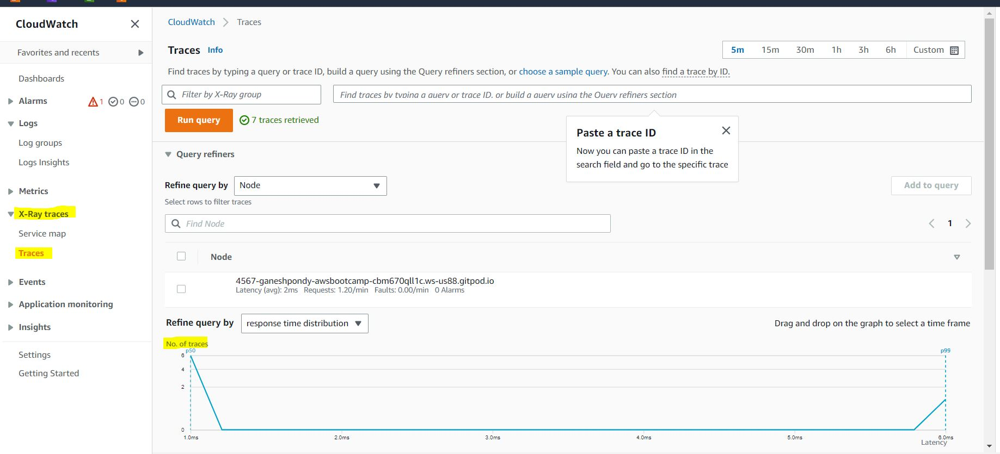

# Week 02 — Distributed Tracing

## 01. HoneyComb

Register in `honeycomb.io`.

Create Enviroment as `bootcamp` and Generate API Keys for Authentication.


Update the  `requirement.txt` file 

```BASH
# For HoneyComb
opentelemetry-api 
opentelemetry-sdk 
opentelemetry-exporter-otlp-proto-http 
opentelemetry-instrumentation-flask 
opentelemetry-instrumentation-requests
```
Run Following `pip` command to install the Packages:

```
pip install -r requirements.txt
```

Update Follwing Lines in `app.py` file to generate the traces for HoneyComb Site.

```PYTHON
from opentelemetry import trace
from opentelemetry.instrumentation.flask import FlaskInstrumentor
from opentelemetry.instrumentation.requests import RequestsInstrumentor
from opentelemetry.exporter.otlp.proto.http.trace_exporter import OTLPSpanExporter
from opentelemetry.sdk.trace import TracerProvider
from opentelemetry.sdk.trace.export import BatchSpanProcessor

```

```PYTHON
# Initialize tracing and an exporter that can send data to Honeycomb
provider = TracerProvider()
processor = BatchSpanProcessor(OTLPSpanExporter())
provider.add_span_processor(processor)
trace.set_tracer_provider(provider)
tracer = trace.get_tracer(__name__)
```

```PYTHON
# Initialize automatic instrumentation with Flask
FlaskInstrumentor().instrument_app(app)
RequestsInstrumentor().instrument()
```

Update `docker-compose.yml` file under `backend-flask` directory:

```YAML
      OTEL_SERVICE_NAME: 'backend-flask'
      OTEL_EXPORTER_OTLP_ENDPOINT: "https://api.honeycomb.io"
      OTEL_EXPORTER_OTLP_HEADERS: "x-honeycomb-team=${HONEYCOMB_API_KEY}"

```

Run Following command to update the ENV Variables:

```BASH
export HONEYCOMB_API_KEY=""
gp env HONEYCOMB_API_KEY=""

export AWS_REGION="ap-south-1"
gp env AWS_REGION="ap-south-1"
```

Start the `docker-compose.yml` File and try to open 'Crudder' App.
And open `honeycomb` and check IO's in the Project.

Open BackEnd URL:


Select DataSets `backend-flask` and you can See some IO's


Click on the Trace ID to View More details about it


More Details about the IO


---

## 02. X-RAY

Update the  `requirement.txt` file 

```BASH
# X-RAY
aws-xray-sdk
```
Run Following `pip` command to install the Packages:

```
pip install -r requirements.txt
```

Update Follwing Lines in `app.py` file to generate the traces for HoneyComb Site.

```PYTHON
# X-RAY
from aws_xray_sdk.core import xray_recorder
from aws_xray_sdk.ext.flask.middleware import XRayMiddleware
```
```PYTHON
xray_url = os.getenv("AWS_XRAY_URL")
xray_recorder.configure(service='backend-flask', dynamic_naming=xray_url)
```

```PYTHON
XRayMiddleware(app, xray_recorder)
```

Update `aws/json/xray.json` File:

```JSON
{
    "SamplingRule": {
        "RuleName": "Cruddur",
        "ResourceARN": "*",
        "Priority": 9000,
        "FixedRate": 0.1,
        "ReservoirSize": 5,
        "ServiceName": "backend-flask",
        "ServiceType": "*",
        "Host": "*",
        "HTTPMethod": "*",
        "URLPath": "*",
        "Version": 1
    }
  }
  ```

Create Group `Cruddur` in `X-Ray`
```BASH
  aws xray create-group \
   --group-name "Cruddur" \
   --filter-expression "service(\"backend-flask\")"
  ```

  

  Create sampling rule

  ```YAML
  aws xray create-sampling-rule --cli-input-json file://aws/json/xray.json
  ```


Add Deamon Service to Docker Compose File

  ```YAML
    xray-daemon:
    image: "amazon/aws-xray-daemon"
    environment:
      AWS_ACCESS_KEY_ID: "${AWS_ACCESS_KEY_ID}"
      AWS_SECRET_ACCESS_KEY: "${AWS_SECRET_ACCESS_KEY}"
      AWS_REGION: "us-east-1"
    command:
      - "xray -o -b xray-daemon:2000"
    ports:
      - 2000:2000/udp
  ```

Update Follwing Variables in Compose file:

```YAML
      AWS_XRAY_URL: "*4567-${GITPOD_WORKSPACE_ID}.${GITPOD_WORKSPACE_CLUSTER_HOST}*"
      AWS_XRAY_DAEMON_ADDRESS: "xray-daemon:2000"
```

Update the Docker Image for the `X-Ray` in Compose file

```YAML
  xray-daemon:
    image: "amazon/aws-xray-daemon"
    environment:
      AWS_ACCESS_KEY_ID: "${AWS_ACCESS_KEY_ID}"
      AWS_SECRET_ACCESS_KEY: "${AWS_SECRET_ACCESS_KEY}"
      AWS_REGION: "ap-south-1"
    command:
      - "xray -o -b xray-daemon:2000"
    ports:
      - 2000:2000/udp
```

Start the `docker-compose.yml` File and try to open 'Crudder' App.
And open `X-Ray` and check IO's in the Project.



Go to Trace to view more Traces:


.


.


---

## 03. Cloud Watch

Update the  `requirement.txt` file 

```BASH
# CloudWatch
watchtower
```
Run Following `pip` command to install the Packages:

```
pip install -r requirements.txt
```

Update Follwing Lines in `app.py` file to generate the traces for HoneyComb Site.

```PYTHON
# CloudWatch
import watchtower
import logging
from time import strftime
```

```PYTHON
# CloudWatch
Configuring Logger to Use CloudWatch
LOGGER = logging.getLogger(__name__)
LOGGER.setLevel(logging.DEBUG)
console_handler = logging.StreamHandler()
cw_handler = watchtower.CloudWatchLogHandler(log_group='cruddur')
LOGGER.addHandler(console_handler)
LOGGER.addHandler(cw_handler)
LOGGER.info("test log")
```

```PYTHON
# CloudWatch
@app.after_request
def after_request(response):
    timestamp = strftime('[%Y-%b-%d %H:%M]')
    LOGGER.error('%s %s %s %s %s %s', timestamp, request.remote_addr, request.method, request.scheme, request.full_path, response.status)
    return response
```

Update Follwing Variables in Compose file:

```YAML
      AWS_DEFAULT_REGION: "${AWS_DEFAULT_REGION}"
      AWS_ACCESS_KEY_ID: "${AWS_ACCESS_KEY_ID}"
      AWS_SECRET_ACCESS_KEY: "${AWS_SECRET_ACCESS_KEY}"

```

Start the `docker-compose.yml` File and try to open 'Crudder' App.
And open `CloudWatch` and check Alerts in the Project.

Open User Activites URL:


Go to `CloudWatch` => `Log Groups` => `cruddur`, You can find the Log Streams:


For More Details, Click on the Log:


---

## 04. RollBar

Register in `rollbar.com`.

Create Project and Get API Keys for Authentication.

Update the  `requirement.txt` file 

```BASH
# Rollbar
blinker
rollbar
```
Run Following `pip` command to install the Packages:

```
pip install -r requirements.txt
pip install rollbar
```

Update API, which is copied from `rollbar.com` :

```YAML
export ROLLBAR_ACCESS_TOKEN=""
gp env ROLLBAR_ACCESS_TOKEN=""
```

Update Follwing Lines in `app.py` file to generate the traces for HoneyComb Site.

```PYTHON
# Rollbar
import rollbar
import rollbar.contrib.flask
from flask import got_request_exception
```
```PYTHON
rollbar_access_token = os.getenv('ROLLBAR_ACCESS_TOKEN')
@app.before_first_request
def init_rollbar():
    """init rollbar module"""
    rollbar.init(
        # access token
        rollbar_access_token,
        # environment name
        'production',
        # server root directory, makes tracebacks prettier
        root=os.path.dirname(os.path.realpath(__file__)),
        # flask already sets up logging
        allow_logging_basic_config=False)

    # send exceptions from `app` to rollbar, using flask's signal system.
    got_request_exception.connect(rollbar.contrib.flask.report_exception, app)

```
```PYTHON
@app.route('/rollbar/test')
def rollbar_test():
    rollbar.report_message('Hello World!', 'warning')
    return "Hello World!"
```

Start the `docker-compose.yml` File and try to open 'Crudder' App and Open url to verify the `rollbar` connection.


Go to Rollbar and check the new alerts:


Break Something in the Code, then we can see the `RED` Alert in the Rollbar


To Get More Details:


