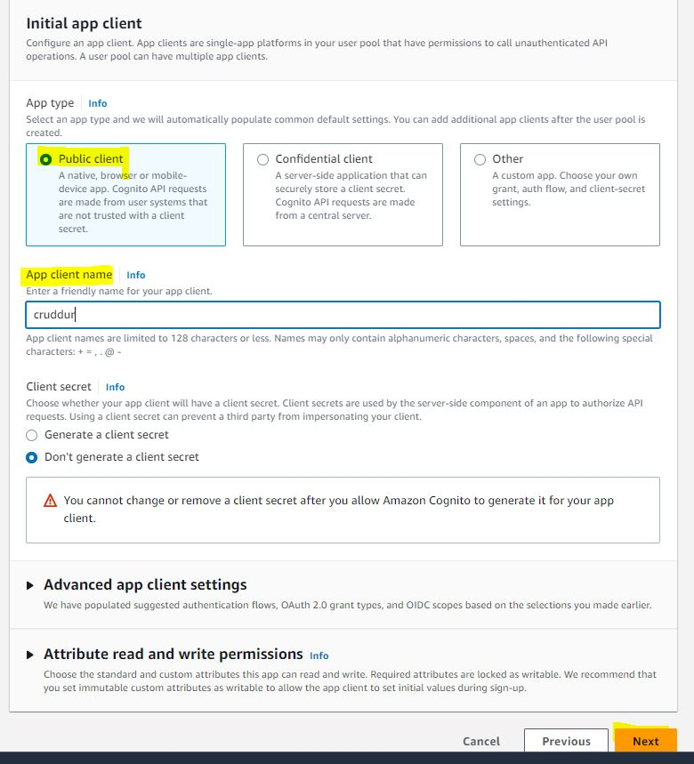

# Week 3 — Decentralized Authentication

## Provision Cognito User Group

* Login to AWS and Go to Cognito
* Follow below ScreenShot Steps to Create Cognito User Group


</br>


</br>


</br>


</br>


</br>


</br>


</br>




</br>


</br>


## FronEnd Updates

### Install AWS Amplify

```BASH
npm i aws-amplify --save
```

### Configure Amplify

Remove local `Cookies` Authentication and apply Cognito Settings

### in frontend-react-js/src/components/ProfileInfo.js

```YAML
import { Auth } from 'aws-amplify';

try {
        await Auth.signOut({ global: true });
        window.location.href = "/"
    } catch (error) {
        console.log('error signing out: ', error);
    }

```

### in frontend-react-js/src/pages/HomeFeedPage.js

```YAML
import { Auth } from 'aws-amplify';

const checkAuth = async () => {
  Auth.currentAuthenticatedUser({
    // Optional, By default is false. 
    // If set to true, this call will send a 
    // request to Cognito to get the latest user data
    bypassCache: false 
  })
  .then((user) => {
    console.log('user',user);
    return Auth.currentAuthenticatedUser()
  }).then((cognito_user) => {

        display_name: cognito_user.attributes.name,
        handle: cognito_user.attributes.preferred_username
 })
  .catch((err) => console.log(err));
};
```

### in frontend-react-js/src/pages/SigninPage.js

```YAML
import { Auth } from 'aws-amplify';

    event.preventDefault();
    Auth.signIn(email, password)
    .then(user => {
      console.log('user',user)
      localStorage.setItem("access_token", user.signInUserSession.accessToken.jwtToken)
    })
    .catch(error => { 
      if (error.code == 'UserNotConfirmedException') {
        window.location.href = "/confirm"
      }
      setErrors(error.message)
    });

```

#### in frontend-react-js/src/pages/ConfirmationPage.js

```YAML
import { Auth } from 'aws-amplify';
    setErrors('')
    try {
      await Auth.resendSignUp(email);
      console.log('code resent successfully');
      setCodeSent(true)
    } catch (err) {
      // does not return a code
      // does cognito always return english
      // for this to be an okay match?
      console.log(err)
      if (err.message == 'Username cannot be empty'){
        setErrors("You need to provide an email in order to send Resend Activiation Code")   
      } else if (err.message == "Username/client id combination not found."){
        setErrors("Email is invalid or cannot be found.")   
      }
    }
    setErrors('')
    try {
      await Auth.confirmSignUp(email, code);
      window.location.href = "/"
    } catch (error) {
      setErrors(error.message)
```

### Create Sample User Cognito

Use below Command to Provide Confirmation using CLI

```BASH
aws cognito-idp admin-set-user-password --username ganeshpondy --password <password> --user-pool-id <Pool-ID> --permanent
```

Then login Crudddur app with the Username and password.

### Register New User

Register New User and It will take you to Sigin Page


You Will be Receving OTP in the mail


Enter the OTP in the Sigin Page, Once you Confirmed then the new user will be Verified in Cognito


Home Page for the User, with your Prefered Name


---

## BackEnd Cognito & JWT Conguration

### Update `backend-flask/app.py`

```YAML
import sys

from lib.cognito_jwt_token import CognitoJwtToken, extract_access_token, TokenVerifyError

cognito_jwt_token = CognitoJwtToken(
  user_pool_id=os.getenv("AWS_COGNITO_USER_POOL_ID"), 
  user_pool_client_id=os.getenv("AWS_COGNITO_USER_POOL_CLIENT_ID"),
  region=os.getenv("AWS_DEFAULT_REGION")
)

headers=['Content-Type', 'Authorization'], 
expose_headers='Authorization',

  access_token = extract_access_token(request.headers)
  try:
    claims = cognito_jwt_token.verify(access_token)
    # authenicatied request
    app.logger.debug("authenicated")
    app.logger.debug(claims)
    app.logger.debug(claims['username'])
    data = HomeActivities.run(cognito_user_id=claims['username'])
  except TokenVerifyError as e:
    # unauthenicatied request
    app.logger.debug(e)
    app.logger.debug("unauthenicated")
    data = HomeActivities.run()

```

Create `backend-flask/lib/cognito_jwt_token.py` File

```YAML
import time
import requests
from jose import jwk, jwt
from jose.exceptions import JOSEError
from jose.utils import base64url_decode

class FlaskAWSCognitoError(Exception):
  pass

class TokenVerifyError(Exception):
  pass

def extract_access_token(request_headers):
    access_token = None
    auth_header = request_headers.get("Authorization")
    if auth_header and " " in auth_header:
        _, access_token = auth_header.split()
    return access_token

class CognitoJwtToken:
    def __init__(self, user_pool_id, user_pool_client_id, region, request_client=None):
        self.region = region
        if not self.region:
            raise FlaskAWSCognitoError("No AWS region provided")
        self.user_pool_id = user_pool_id
        self.user_pool_client_id = user_pool_client_id
        self.claims = None
        if not request_client:
            self.request_client = requests.get
        else:
            self.request_client = request_client
        self._load_jwk_keys()


    def _load_jwk_keys(self):
        keys_url = f"https://cognito-idp.{self.region}.amazonaws.com/{self.user_pool_id}/.well-known/jwks.json"
        try:
            response = self.request_client(keys_url)
            self.jwk_keys = response.json()["keys"]
        except requests.exceptions.RequestException as e:
            raise FlaskAWSCognitoError(str(e)) from e

    @staticmethod
    def _extract_headers(token):
        try:
            headers = jwt.get_unverified_headers(token)
            return headers
        except JOSEError as e:
            raise TokenVerifyError(str(e)) from e

    def _find_pkey(self, headers):
        kid = headers["kid"]
        # search for the kid in the downloaded public keys
        key_index = -1
        for i in range(len(self.jwk_keys)):
            if kid == self.jwk_keys[i]["kid"]:
                key_index = i
                break
        if key_index == -1:
            raise TokenVerifyError("Public key not found in jwks.json")
        return self.jwk_keys[key_index]

    @staticmethod
    def _verify_signature(token, pkey_data):
        try:
            # construct the public key
            public_key = jwk.construct(pkey_data)
        except JOSEError as e:
            raise TokenVerifyError(str(e)) from e
        # get the last two sections of the token,
        # message and signature (encoded in base64)
        message, encoded_signature = str(token).rsplit(".", 1)
        # decode the signature
        decoded_signature = base64url_decode(encoded_signature.encode("utf-8"))
        # verify the signature
        if not public_key.verify(message.encode("utf8"), decoded_signature):
            raise TokenVerifyError("Signature verification failed")

    @staticmethod
    def _extract_claims(token):
        try:
            claims = jwt.get_unverified_claims(token)
            return claims
        except JOSEError as e:
            raise TokenVerifyError(str(e)) from e

    @staticmethod
    def _check_expiration(claims, current_time):
        if not current_time:
            current_time = time.time()
        if current_time > claims["exp"]:
            raise TokenVerifyError("Token is expired")  # probably another exception

    def _check_audience(self, claims):
        # and the Audience  (use claims['client_id'] if verifying an access token)
        audience = claims["aud"] if "aud" in claims else claims["client_id"]
        if audience != self.user_pool_client_id:
            raise TokenVerifyError("Token was not issued for this audience")

    def verify(self, token, current_time=None):
        """ https://github.com/awslabs/aws-support-tools/blob/master/Cognito/decode-verify-jwt/decode-verify-jwt.py """
        if not token:
            raise TokenVerifyError("No token provided")

        headers = self._extract_headers(token)
        pkey_data = self._find_pkey(headers)
        self._verify_signature(token, pkey_data)

        claims = self._extract_claims(token)
        self._check_expiration(claims, current_time)
        self._check_audience(claims)

        self.claims = claims 
        return claims
```

### Update `backend-flask/requirements.txt` File
`Flask-AWSCognito`

### Add ENV Variable in `docker-compose.yml`

```YAML
      AWS_COGNITO_USER_POOL_ID: "<COGNITO_USER_POOL_ID>"
      AWS_COGNITO_USER_POOL_CLIENT_ID: "<Client-ID>"
```

### Login the Curddur App


---

## Update CSS Files for the Better FronEnd Experiance

Update Following CSS Files for the Look:


---

### Refresh the Page and you will Get the New Look of CURRDUR


