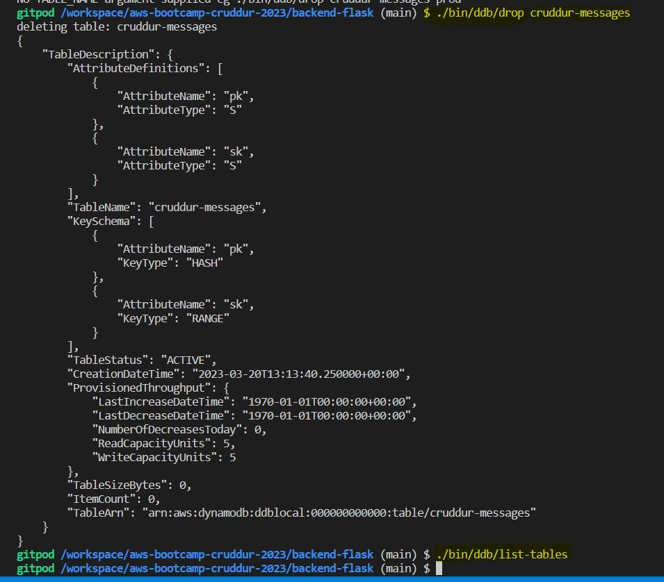
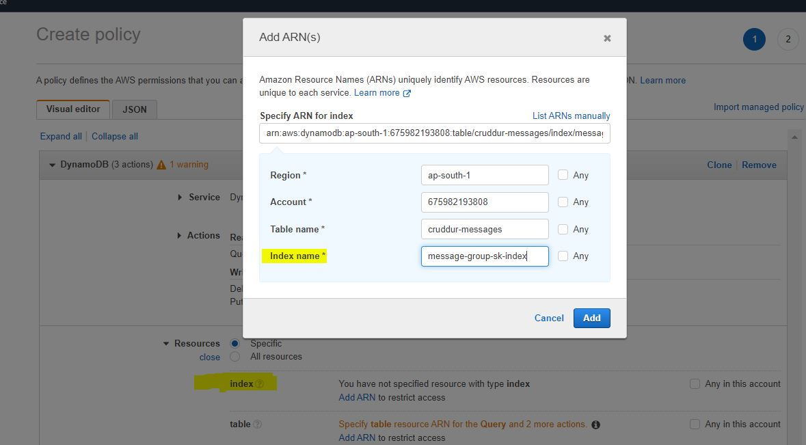

# Week 5 — DynamoDB

## DynamoDB Modelling


</br>


## DynamoDB Data Modeling Excel


</br>

## Local DynamoDB

Enable DynamoDB Steps in docker-compose file

```YAML
    backend-flask:
        environment:
        AWS_ENDPOINT_URL: "http://dynamodb-local:8000"
```

Start DynamoDB Container in Local from docker-compose.yml file

Create ddb folder under `backend-flask/bin` and Script Files

#### ./bin/ddb/list-tables

```BASH
#! /usr/bin/bash
set -e # stop if it fails at any point

if [ "$1" = "prod" ]; then
  ENDPOINT_URL=""
else
  ENDPOINT_URL="--endpoint-url=http://localhost:8000"
fi

aws dynamodb list-tables $ENDPOINT_URL \
--query TableNames \
--output table
```

#### ./bin/ddb/scan

```BASH
#!/usr/bin/env python3

import boto3

attrs = {
  'endpoint_url': 'http://localhost:8000'
}
ddb = boto3.resource('dynamodb',**attrs)
table_name = 'cruddur-messages'

table = ddb.Table(table_name)
response = table.scan()

items = response['Items']
for item in items:
  print(item)
```

#### ./bin/ddb/schema-load

```PYTHON
#!/usr/bin/env python3

import boto3
import sys

attrs = {
  'endpoint_url': 'http://localhost:8000'
}

if len(sys.argv) == 2:
  if "prod" in sys.argv[1]:
    attrs = {}

ddb = boto3.client('dynamodb',**attrs)

table_name = 'cruddur-messages'


response = ddb.create_table(
  TableName=table_name,
  AttributeDefinitions=[
    {
      'AttributeName': 'message_group_uuid',
      'AttributeType': 'S'
    },
    {
      'AttributeName': 'pk',
      'AttributeType': 'S'
    },
    {
      'AttributeName': 'sk',
      'AttributeType': 'S'
    },
  ],
  KeySchema=[
    {
      'AttributeName': 'pk',
      'KeyType': 'HASH'
    },
    {
      'AttributeName': 'sk',
      'KeyType': 'RANGE'
    },
  ],
  GlobalSecondaryIndexes= [{
    'IndexName':'message-group-sk-index',
    'KeySchema':[{
      'AttributeName': 'message_group_uuid',
      'KeyType': 'HASH'
    },{
      'AttributeName': 'sk',
      'KeyType': 'RANGE'
    }],
    'Projection': {
      'ProjectionType': 'ALL'
    },
    'ProvisionedThroughput': {
      'ReadCapacityUnits': 5,
      'WriteCapacityUnits': 5
    },
  }],
  BillingMode='PROVISIONED',
  ProvisionedThroughput={
      'ReadCapacityUnits': 5,
      'WriteCapacityUnits': 5
  }
)

print(response)
```

#### ./bin/ddb/seed

```PYTHON
#!/usr/bin/env python3

import boto3
import os
import sys
from datetime import datetime, timedelta, timezone
import uuid

# Set up the path for the parent directory to import custom modules
current_path = os.path.dirname(os.path.abspath(__file__))
parent_path = os.path.abspath(os.path.join(current_path, '..', '..'))
sys.path.append(parent_path)

# Import a custom module named "db"
from lib.db import db

# Set up the attributes for the local DynamoDB instance
attrs = {
  'endpoint_url': 'http://localhost:8000'
}

# If the script is being run with a "prod" argument, use production database instead
if len(sys.argv) == 2:
  if "prod" in sys.argv[1]:
    attrs = {}

# Connect to the DynamoDB instance
ddb = boto3.client('dynamodb',**attrs)

# Define a function to retrieve user UUIDs from the database
def get_user_uuids():
  sql = """
    SELECT 
      users.uuid,
      users.display_name,
      users.handle
    FROM users
    WHERE
      users.handle IN(
        %(my_handle)s,
        %(other_handle)s
        )
  """
  users = db.query_array_json(sql,{
    'my_handle':  'andrewbrown',
    'other_handle': 'bayko'
  })
  my_user    = next((item for item in users if item["handle"] == 'andrewbrown'), None)
  other_user = next((item for item in users if item["handle"] == 'bayko'), None)
  results = {
    'my_user': my_user,
    'other_user': other_user
  }
  print('get_user_uuids')
  print(results)
  return results

def create_message_group(client,message_group_uuid, my_user_uuid, last_message_at=None, message=None, other_user_uuid=None, other_user_display_name=None, other_user_handle=None):
  table_name = 'cruddur-messages'
  record = {
    'pk':   {'S': f"GRP#{my_user_uuid}"},
    'sk':   {'S': last_message_at},
    'message_group_uuid': {'S': message_group_uuid},
    'message':  {'S': message},
    'user_uuid': {'S': other_user_uuid},
    'user_display_name': {'S': other_user_display_name},
    'user_handle': {'S': other_user_handle}
  }

  response = client.put_item(
    TableName=table_name,
    Item=record
  )
  print(response)

def create_message(client,message_group_uuid, created_at, message, my_user_uuid, my_user_display_name, my_user_handle):
  table_name = 'cruddur-messages'
  record = {
    'pk':   {'S': f"MSG#{message_group_uuid}"},
    'sk':   {'S': created_at },
    'message_uuid': { 'S': str(uuid.uuid4()) },
    'message': {'S': message},
    'user_uuid': {'S': my_user_uuid},
    'user_display_name': {'S': my_user_display_name},
    'user_handle': {'S': my_user_handle}
  }
  # insert the record into the table
  response = client.put_item(
    TableName=table_name,
    Item=record
  )
  # print the response
  print(response)

message_group_uuid = "5ae290ed-55d1-47a0-bc6d-fe2bc2700399" 
now = datetime.now(timezone.utc).astimezone()
users = get_user_uuids()

create_message_group(
  client=ddb,
  message_group_uuid=message_group_uuid,
  my_user_uuid=users['my_user']['uuid'],
  other_user_uuid=users['other_user']['uuid'],
  other_user_handle=users['other_user']['handle'],
  other_user_display_name=users['other_user']['display_name'],
  last_message_at=now.isoformat(),
  message="this is a filler message"
)

create_message_group(
  client=ddb,
  message_group_uuid=message_group_uuid,
  my_user_uuid=users['other_user']['uuid'],
  other_user_uuid=users['my_user']['uuid'],
  other_user_handle=users['my_user']['handle'],
  other_user_display_name=users['my_user']['display_name'],
  last_message_at=now.isoformat(),
  message="this is a filler message"
)

conversation = """
Person 1: Have you ever watched Babylon 5? It's one of my favorite TV shows!
Person 2: Yes, I have! I love it too. What's your favorite season?
...
...
...
Person 2: Yes, that's a good point. Babylon 5 was really great at creating a diverse and interesting cast of characters, with each one feeling like a fully-realized and distinct individual.
Person 1: And Zathras was just one example of that. He was a small but important part of the show's legacy, and he's still remembered fondly by fans today.
Person 2: Definitely. I think his character is a great example of the show's ability to balance humor and heart, and to create memorable and beloved characters that fans will cherish for years to come.
"""


lines = conversation.lstrip('\n').rstrip('\n').split('\n')
for i in range(len(lines)):
  if lines[i].startswith('Person 1: '):
    key = 'my_user'
    message = lines[i].replace('Person 1: ', '')
  elif lines[i].startswith('Person 2: '):
    key = 'other_user'
    message = lines[i].replace('Person 2: ', '')
  else:
    print(lines[i])
    raise 'invalid line'

  created_at = (now + timedelta(minutes=i)).isoformat()
  create_message(
    client=ddb,
    message_group_uuid=message_group_uuid,
    created_at=created_at,
    message=message,
    my_user_uuid=users[key]['uuid'],
    my_user_display_name=users[key]['display_name'],
    my_user_handle=users[key]['handle']
  )
```

#### ./bin/ddb/drop

```BASH
#! /usr/bin/bash

set -e # stop if it fails at any point

if [ -z "$1" ]; then
  echo "No TABLE_NAME argument supplied eg ./bin/ddb/drop cruddur-messages prod "
  exit 1
fi
TABLE_NAME=$1

if [ "$2" = "prod" ]; then
  ENDPOINT_URL=""
else
  ENDPOINT_URL="--endpoint-url=http://localhost:8000"
fi

echo "deleting table: $TABLE_NAME"

aws dynamodb delete-table $ENDPOINT_URL \
  --table-name $TABLE_NAME
```

#### ./bin/ddb/patterns/get-conversation

```python
#!/usr/bin/env python3

import boto3
import sys
import json
import datetime

attrs = {
  'endpoint_url': 'http://localhost:8000'
}

if len(sys.argv) == 2:
  if "prod" in sys.argv[1]:
    attrs = {}

dynamodb = boto3.client('dynamodb',**attrs)
table_name = 'cruddur-messages'

message_group_uuid = "5ae290ed-55d1-47a0-bc6d-fe2bc2700399"

year = str(datetime.datetime.now().year)
# define the query parameters
query_params = {
  'TableName': table_name,
  'ScanIndexForward': False,
  'Limit': 20,
  'ReturnConsumedCapacity': 'TOTAL',
  'KeyConditionExpression': 'pk = :pk AND begins_with(sk,:year)',
  #'KeyConditionExpression': 'pk = :pk AND sk BETWEEN :start_date AND :end_date',
  'ExpressionAttributeValues': {
    ':year': {'S': year },
    #":start_date": { "S": "2023-03-01T00:00:00.000000+00:00" },
    #":end_date": { "S": "2023-03-19T23:59:59.999999+00:00" },
    ':pk': {'S': f"MSG#{message_group_uuid}"}
  }
}


# query the table
response = dynamodb.query(**query_params)

# print the items returned by the query
print(json.dumps(response, sort_keys=True, indent=2))

# print the consumed capacity
print(json.dumps(response['ConsumedCapacity'], sort_keys=True, indent=2))

items = response['Items']
reversed_array = items[::-1]
# items.reverse()

for item in reversed_array:
  sender_handle = item['user_handle']['S']
  message       = item['message']['S']
  timestamp     = item['sk']['S']
  dt_object = datetime.datetime.strptime(timestamp, '%Y-%m-%dT%H:%M:%S.%f%z')
  formatted_datetime = dt_object.strftime('%Y-%m-%d %I:%M %p')
  print(f'{sender_handle: <12}{formatted_datetime: <22}{message[:40]}...')
```

#### ./bin/ddb/patterns/list-conversations

```python
#!/usr/bin/env python3

import boto3
import sys
import json
import os

current_path = os.path.dirname(os.path.abspath(__file__))
parent_path = os.path.abspath(os.path.join(current_path, '..', '..', '..'))
sys.path.append(parent_path)
from lib.db import db

attrs = {
  'endpoint_url': 'http://localhost:8000'
}

if len(sys.argv) == 2:
  if "prod" in sys.argv[1]:
    attrs = {}

dynamodb = boto3.client('dynamodb',**attrs)
table_name = 'cruddur-messages'

def get_my_user_uuid():
  sql = """
    SELECT 
      users.uuid
    FROM users
    WHERE
      users.handle =%(handle)s
  """
  uuid = db.query_value(sql,{
    'handle':  'andrewbrown'
  })
  return uuid

my_user_uuid = get_my_user_uuid()
print(f"my-uuid: {my_user_uuid}")
year = str(datetime.now().year)
# define the query parameters
query_params = {
  'TableName': table_name,
  'KeyConditionExpression': 'pk = :pk AND begins_with(sk,:year)',
  'ScanIndexForward': False,
  'ExpressionAttributeValues': {
    ':year': {'S': year },
    ':pk': {'S': f"GRP#{my_user_uuid}"}
  },
  'ReturnConsumedCapacity': 'TOTAL'
}

# query the table
response = dynamodb.query(**query_params)

# print the items returned by the query
print(json.dumps(response, sort_keys=True, indent=2))
```

Update `requirements.txt` file with `boto3` module.

```
pip install -r requirements.txt
```

#### Connect DynamoDB with AWS CLI.

Now Table is not yet created.

```YAML
$ aws dynamodb list-tables --endpoint-url http://localhost:8000
{
    "TableNames": []
}
```


#### To create 'cruddur-message' Table

run `./bin/ddb/schema-load` script to create table on DynamoDB 

```BASH
/backend-flask (main) $ ./bin/ddb/schema-load 
{'TableDescription': {'AttributeDefinitions': [{'AttributeName': 'pk', 'AttributeType': 'S'}, {'AttributeName': 'sk', 'AttributeType': 'S'}], 'TableName': 'cruddur-message', 'KeySchema': [{'AttributeName': 'pk', 'KeyType': 'HASH'}, {'AttributeName': 'sk', 'KeyType': 'RANGE'}], 'TableStatus': 'ACTIVE', 'CreationDateTime': datetime.datetime(2023, 3, 20, 8, 47, 10, 228000, tzinfo=tzlocal()), 'ProvisionedThroughput': {'LastIncreaseDateTime': datetime.datetime(1970, 1, 1, 0, 0, tzinfo=tzlocal()), 'LastDecreaseDateTime': datetime.datetime(1970, 1, 1, 0, 0, tzinfo=tzlocal()), 'NumberOfDecreasesToday': 0, 'ReadCapacityUnits': 5, 'WriteCapacityUnits': 5}, 'TableSizeBytes': 0, 'ItemCount': 0, 'TableArn': 'arn:aws:dynamodb:ddblocal:000000000000:table/cruddur-message'}, 'ResponseMetadata': {'RequestId': '2d89e15e-7985-42cd-8ea2-2c9d14080f10', 'HTTPStatusCode': 200, 'HTTPHeaders': {'date': 'Mon, 20 Mar 2023 08:47:10 GMT', 'x-amzn-requestid': '2d89e15e-7985-42cd-8ea2-2c9d14080f10', 'content-type': 'application/x-amz-json-1.0', 'x-amz-crc32': '390642198', 'content-length': '578', 'server': 'Jetty(9.4.48.v20220622)'}, 'RetryAttempts': 0}}
```

CLI Command to check the Table

```YAML
aws dynamodb list-tables --endpoint-url http://localhost:8000
{
    "TableNames": [
        "cruddur-message"
    ]
}
```
View to Table using Script `sh ./bin/ddb/list-tables`

```BASH
 $ sh ./bin/ddb/list-tables 
----------------------
|     ListTables     |
+--------------------+
|  cruddur-messages  |
+--------------------+
```


#### Drop the DynamoDB Table



</br>
</br>


update the file `backend-flask/db/seed.sql` and load it.

```YAML
-- this file was manually created
INSERT INTO public.users (display_name, email, handle, cognito_user_id)
VALUES
  ('Andrew Brown','andrew@exampro.co' , 'andrewbrown' ,'MOCK'),
  ('Andrew Bayko','bayko@exampro.co' , 'bayko' ,'MOCK'),
  ('Londo Mollari','lmollari@centari.com' ,'londo' ,'MOCK'),
  ('ganesh live','ganeshpondy@mail.com' , 'ganeshlive' ,'MOCK'),
  ('ganesh nir','ganeshnir@mail.com' , 'ganeshnir' ,'MOCK');

INSERT INTO public.activities (user_uuid, message, expires_at)
VALUES
  (
    (SELECT uuid from public.users WHERE users.handle = 'andrewbrown' LIMIT 1),
    'This was imported as seed data!',
    current_timestamp + interval '10 day'
  )
```

run `./bin/db/setup` for PostgresDB 

```
backend-flask (main) $ ./bin/db/setup 
==== db-setup
== db-drop
DB-DROP
DROP DATABASE
== db-create
DB-CREATE
CREATE DATABASE
== db-schema-load
```

```SQL
/backend-flask/db/seed.sql
####################################
Connecting Local Postgres SQL....
####################################
INSERT 0 4
INSERT 0 1
###### Completed on Local PostgresSQL #######
gitpod /workspace/aws-bootcamp-cruddur-2023/backend-flask (main) $ 
```

Then User Table is Update and Activity Table also Updated


Then `Schema-load`


</br>
</br>


And Then Load Data with the `Sees` File.


</br>
</br>

Get and List the Conversion with the Scripts


---

## AWS DynamoDB

1. Update the schema-load file

1. Creat Table on AWS DynamoDB

    `./bin/ddb/schema-load prod`

2. Enable Streams on the Table with "New" Image
	cruddur-messages => Exports and Streams ==> DynamoDB stream details => Trun on

3. Create VPC EndPoint

4. Create Lambda Function
	1. Deploy Python Code
	2. Add VPC
		AWSLambdaInvocation-DynamoDB
		AWSDynamoDBFullAccess	=> Custom
	3. Add IAM Policy

5.  Add Lambda Trigger in DynamoDB Table "cruddur-messages"

	DynamoDB => Tables => cruddur-messages => Exports and Streams

6. Hash backend-flask Docker-Compose file to pointout to AWS DynamoDB
```
	backend-flask:
		environment:
		  # AWS_ENDPOINT_URL: "http://dynamodb-local:8000"
```		  

7. Implement (Pattern A) Listing Messages in Message Group into Application
7. Implement (Pattern B) Listing Messages Group into Application
7. Implement (Pattern B) Listing Messages Group into Application
7. Implement (Pattern C) Creating a Message for an existing Message Group into Application
7. Implement (Pattern D) Creating a Message for a new Message Group into Application

7. Implement (Pattern E) Updating a Message Group using DynamoDB Streams
  https://3000-ganeshpondy-awsbootcamp-zs83gdiqdsf.ws-us92.gitpod.io/messages/new/ganeshnir
  https://3000-ganeshpondy-awsbootcamp-zs83gdiqdsf.ws-us92.gitpod.io/messages/40424a4f-b3a3-4899-933e-a29a15de42bc
</br>
### Update the file with the below lines


And Then Load Data with the `Sees` File.


</br>
</br>

### Create DynamoDB Table


</br>
</br>


</br>
</br>


</br>
</br>


</br>
</br>

### Create VPC EndPoint


</br>
</br>


</br>
</br>


</br>
</br>


</br>
</br>


</br>
</br>


</br>
</br>

### Create Lamdba


</br>
</br>


</br>
</br>


</br>
</br>


</br>
</br>


</br>
</br>

### Create IAM Policy for Lamdba


</br>
</br>


</br>
</br>


</br>
</br>


</br>
</br>


</br>
</br>


</br>
</br>


</br>
</br>

### Add Lambda in Table


</br>
</br>


</br>
</br>

### Lambda WatchLog 


</br>
</br>


</br>
</br>

---

#### To Start a new Conversion


#### Chat with the Message id


### Challenges

1.    Add Python at the starting of line to run set script without error 

       `./bin/db/setup`
       ` python "$bin_path/db/update_cognito_user_ids"`

</br>

2.    Cognito ID’s might be not updated, when are running “update_cognito_user_ids” because “andrewbrown” and “bayko” ID’s are present in your AWS Cognito users list.
        If you want, you can update the dummy “Cognito ID” manually for both the users.
        Follow below steps:
</br>
Step1:
      ` ./bin/db/connect`
</br>
Step2:
</br>

```SQL
\dt
SELECT * FROM users;
UPDATE public.users SET cognito_user_id = 'f73f4a05-a59e-468a-8a29-a1c39e7a1111' WHERE users.handle = 'andrewbrown';
UPDATE public.users SET cognito_user_id = 'f73f4b05-a59e-468b-8a29-a1c39e7a2222' WHERE users.handle = 'bayko';
SELECT * FROM users; 

```
</br>

Before:

After:


3.    Open chat with the message-id
         To get the message id, to view the chat
 
`./bin/ddb/scan | grep -i message_group_uuid `

           https://<gitpod-url>/messages/<message-id>
           Sample: https:// 300.gitpod.io/messages/5ae290ed-55d1-47a0-bc6d-fe2bc2700399
    
```YAML
/backend-flask (main) $ ./bin/ddb/scan | grep -i message_group_uuid
{'user_uuid': '5e1a2309-f0d5-415c-bb58-f65bf48f60fd', 'message_group_uuid': '5ae290ed-55d1-47a0-bc6d-fe2bc2700399', 'user_handle': 'bayko', 'sk': '2023-03-22T14:00:54.934956+00:00', 'pk': 'GRP#c65c619a-ff81-45e8-89f2-450079d732f7', 'message': 'this is a filler message', 'user_display_name': 'Andrew Bayko'}
{'user_uuid': '3d362a09-9c33-46e4-a1b7-77a4c15f07b9', 'message_group_uuid': 'bf739c1c-2dc0-489e-8b4f-52edc41a231b', 'user_handle': 'ganeshnir', 'sk': '2023-03-22T14:23:07.403278+00:00', 'pk': 'GRP#97b477c5-c420-4da9-9261-3886ae58757e', 'message': 'test', 'user_display_name': 'ganesh nir'}
{'user_uuid': '3d362a09-9c33-46e4-a1b7-77a4c15f07b9', 'message_group_uuid': '6244ab98-497d-4b35-9853-5c3414c10b76', 'user_handle': 'ganeshnir', 'sk': '2023-03-22T14:23:07.770434+00:00', 'pk': 'GRP#97b477c5-c420-4da9-9261-3886ae58757e', 'message': 'test', 'user_display_name': 'ganesh nir'}
{'user_uuid': 'c65c619a-ff81-45e8-89f2-450079d732f7', 'message_group_uuid': '5ae290ed-55d1-47a0-bc6d-fe2bc2700399', 'user_handle': 'andrewbrown', 'sk': '2023-03-22T14:00:54.934956+00:00', 'pk': 'GRP#5e1a2309-f0d5-415c-bb58-f65bf48f60fd', 'message': 'this is a filler message', 'user_display_name': 'Andrew Brown'}
{'user_uuid': '97b477c5-c420-4da9-9261-3886ae58757e', 'message_group_uuid': 'bf739c1c-2dc0-489e-8b4f-52edc41a231b', 'user_handle': 'ganeshlive', 'sk': '2023-03-22T14:23:07.403278+00:00', 'pk': 'GRP#3d362a09-9c33-46e4-a1b7-77a4c15f07b9', 'message': 'test', 'user_display_name': 'ganesh live'}
{'user_uuid': '97b477c5-c420-4da9-9261-3886ae58757e', 'message_group_uuid': '6244ab98-497d-4b35-9853-5c3414c10b76', 'user_handle': 'ganeshlive', 'sk': '2023-03-22T14:23:07.770434+00:00', 'pk': 'GRP#3d362a09-9c33-46e4-a1b7-77a4c15f07b9', 'message': 'test', 'user_display_name': 'ganesh live'}
```


</br>
</br>

4.    Update `endpoint_url`, in Lambda code

```YAML
dynamodb = boto3.resource(
'dynamodb',
  region_name=.<Region>',
  #  endpoint_url="http://dynamodb.ca-central-1.amazonaws.com"
    endpoint_url="http://dynamodb.<Region>.amazonaws.com"
)
```

5. For Message Token Error in backend container
   Logout and Loigin to the Curudder App:


