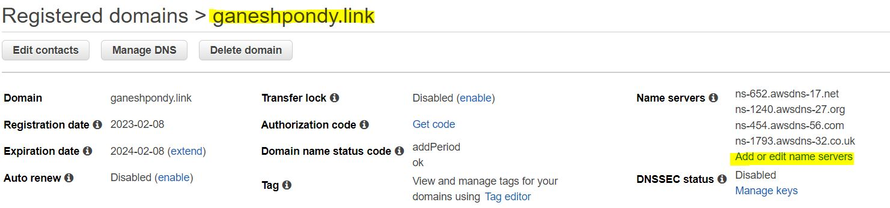
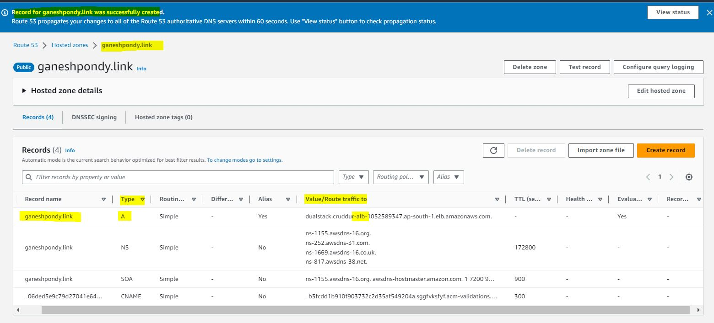
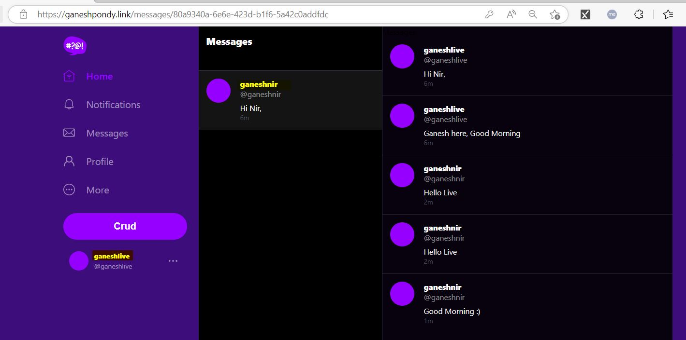

# Week 6 — Deploying Containers

#### Check the Prod DB Connection

Check the Prod DB Connection and run health-check script for Flask app

```sh
export GITPOD_IP=$(curl ifconfig.me)
./bin/rds/rds-update-sg-rule 
```
```yaml
export GITPOD_IP=$(curl ifconfig.me)
gitpod /workspace/aws-bootcamp-cruddur-2023/backend-flask (main) $ ./bin/rds/rds-update-sg-rule 
==== rds-update-sg-rule
{
    "Return": true
}
gitpod /workspace/aws-bootcamp-cruddur-2023/backend-flask (main) $ ./bin/db/test 
attempting connection
Connection successful!
gitpod /workspace/aws-bootcamp-cruddur-2023/backend-flask (main) $ 
```
</br>

#### Create "cloudwatch" log groups

```sh
aws logs create-log-group --log-group-name cruddur
aws logs put-retention-policy --log-group-name cruddur --retention-in-days 1
```


### Create NameSpace is "AWS Cloud Map"


### Create ECS Cluster

```sh
aws ecs create-cluster \
--cluster-name cruddur \
--service-connect-defaults namespace=cruddur
```


</br>
</br>


#### Create Docker Images and Push to ECR
 1. Base Image for Python
 2. Backend Image
 3. Frontend image

#### 1. Base Image of Python

```sh
aws ecr create-repository \
  --repository-name cruddur-python \
  --image-tag-mutability MUTABLE
```

```yaml
gitpod /workspace/aws-bootcamp-cruddur-2023 (main) $ aws ecr create-repository \
>   --repository-name cruddur-python \
>   --image-tag-mutability MUTABLE
{
    "repository": {
        "repositoryArn": "arn:aws:ecr:ap-south-1:675982193808:repository/cruddur-python",
        "registryId": "675982193808",
        "repositoryName": "cruddur-python",
        "repositoryUri": "675982193808.dkr.ecr.ap-south-1.amazonaws.com/cruddur-python",
        "createdAt": "2023-04-01T00:41:07+00:00",
        "imageTagMutability": "MUTABLE",
        "imageScanningConfiguration": {
            "scanOnPush": false
        },
        "encryptionConfiguration": {
            "encryptionType": "AES256"
        }
    }
}
```


#### To Connect ECR and docker login

```sh 
aws ecr get-login-password --region $AWS_DEFAULT_REGION | docker login --username AWS --password-stdin "$AWS_ACCOUNT_ID.dkr.ecr.$AWS_DEFAULT_REGION.amazonaws.com"
```

```sh
$ aws ecr get-login-password --region $AWS_DEFAULT_REGION | docker login --username AWS --password-stdin "$AWS_ACCOUNT_ID.dkr.ecr.$AWS_DEFAULT_REGION.amazonaws.com"
WARNING! Your password will be stored unencrypted in /home/gitpod/.docker/config.json.
Configure a credential helper to remove this warning. See
https://docs.docker.com/engine/reference/commandline/login/#credentials-store

Login Succeeded
$ 
```

Update the ECR path to Variable 'ECR_PYTHON_URL`

```sh
export ECR_PYTHON_URL="$AWS_ACCOUNT_ID.dkr.ecr.$AWS_DEFAULT_REGION.amazonaws.com/cruddur-python"
echo $ECR_PYTHON_URL
675982193808.dkr.ecr.ap-south-1.amazonaws.com/cruddur-python
```

#### Pull the Image 

Pull the Python Image in the Gitpod

```sh
docker pull python:3.10-slim-buster
```
#### Tag the Image
```sh
docker tag python:3.10-slim-buster $ECR_PYTHON_URL:3.10-slim-buster
```
```yaml
docker images | grep -i 3.10-slim-buster
675982193808.dkr.ecr.ap-south-1.amazonaws.com/cruddur-python   3.10-slim-buster   a8bd408e774a   8 days ago       118MB
python   3.10-slim-buster   a8bd408e774a   8 days ago       118MB
```

#### Push the Image to ECR

Push the Image to AWS ECR
```sh
docker push $ECR_PYTHON_URL:3.10-slim-buster
```
```yaml
$ docker push $ECR_PYTHON_URL:3.10-slim-buster
The push refers to repository [675982193808.dkr.ecr.ap-south-1.amazonaws.com/cruddur-python]
128cd062b35d: Pushed 
44ae7921fd10: Pushed 
075372db15c2: Pushed 
d1a969d0e2e5: Pushed 
c9182c130984: Pushed 
3.10-slim-buster: digest: sha256:31827b60ef2becea7b6b017f309c57062f7b3f37ad309eb57e9ed20411690c01 size: 1370
```


#### Remove image from local 

Remove image from Gitpod 

```sh
docker image rm $ECR_PYTHON_URL:3.10-slim-buster
```

```yaml
docker image rm $ECR_PYTHON_URL:3.10-slim-buster
Untagged: 675982193808.dkr.ecr.ap-south-1.amazonaws.com/cruddur-python:3.10-slim-buster
Untagged: 675982193808.dkr.ecr.ap-south-1.amazonaws.com/cruddur-python@sha256:31827b60ef2becea7b6b017f309c57062f7b3f37ad309eb57e9ed20411690c01
```
```sh
 docker images | grep -i 3.10-slim-buster
python    3.10-slim-buster   a8bd408e774a   9 days ago       118MB
```

#### docker-compose up

Start the all Containers in Docker-Compose File and check the backend container Health check

```sh
curl https://4567-ganeshpondy-awsbootcamp-kff269iaaag.ws-us93.gitpod.io/api/health-check
{
  "success": true
}
```


#### Create Backend repo & tag & Push the code to ECR
```sh
aws ecr create-repository \
  --repository-name backend-flask \
  --image-tag-mutability MUTABLE

export ECR_BACKEND_FLASK_URL="$AWS_ACCOUNT_ID.dkr.ecr.$AWS_DEFAULT_REGION.amazonaws.com/backend-flask"
echo $ECR_BACKEND_FLASK_URL

docker build -t backend-flask .

docker tag backend-flask:latest $ECR_BACKEND_FLASK_URL:latest

docker push $ECR_BACKEND_FLASK_URL:latest
```


----

Updated TimeZone Steps for Timezones for ISO 8601

----

### Update the variables in "Parameter store"

Update the variables in the "AWS Systems Manager Parameter Store"

```sh
aws ssm put-parameter --type "SecureString" --name "/cruddur/backend-flask/AWS_ACCESS_KEY_ID" --value $AWS_ACCESS_KEY_ID
aws ssm put-parameter --type "SecureString" --name "/cruddur/backend-flask/AWS_SECRET_ACCESS_KEY" --value $AWS_SECRET_ACCESS_KEY
aws ssm put-parameter --type "SecureString" --name "/cruddur/backend-flask/CONNECTION_URL" --value $PROD_CONNECTION_URL
aws ssm put-parameter --type "SecureString" --name "/cruddur/backend-flask/ROLLBAR_ACCESS_TOKEN" --value $ROLLBAR_ACCESS_TOKEN
aws ssm put-parameter --type "SecureString" --name "/cruddur/backend-flask/OTEL_EXPORTER_OTLP_HEADERS" --value "x-honeycomb-team=$HONEYCOMB_API_KEY"
```

```yaml
$ aws ssm put-parameter --type "SecureString" --name "/cruddur/backend-flask/AWS_ACCESS_KEY_ID" --value $AWS_ACCESS_KEY_ID
{
    "Version": 1,
    "Tier": "Standard"
}
$ aws ssm put-parameter --type "SecureString" --name "/cruddur/backend-flask/AWS_SECRET_ACCESS_KEY" --value $AWS_SECRET_ACCESS_KEY
{
    "Version": 1,
    "Tier": "Standard"
}
$ aws ssm put-parameter --type "SecureString" --name "/cruddur/backend-flask/CONNECTION_URL" --value $PROD_CONNECTION_URL
{
    "Version": 1,
    "Tier": "Standard"
}
$ aws ssm put-parameter --type "SecureString" --name "/cruddur/backend-flask/ROLLBAR_ACCESS_TOKEN" --value $ROLLBAR_ACCESS_TOKEN
{
    "Version": 1,
    "Tier": "Standard"
}
$ aws ssm put-parameter --type "SecureString" --name "/cruddur/backend-flask/OTEL_EXPORTER_OTLP_HEADERS" --value "x-honeycomb-team=$HONEYCOMB_API_KEY"
{
    "Version": 1,
    "Tier": "Standard"
}
$ 
```


---

## Create IAM Role

Follow the below Steps to Create IAM Role and 


</br>
</br>


</br>


</br>


</br>


</br>


</br>

```yaml
aws iam list-roles | grep -i RoleName
            "RoleName": "AWSServiceRoleForCloudTrail",
            "RoleName": "AWSServiceRoleForECS",
            "RoleName": "AWSServiceRoleForOrganizations",
            "RoleName": "AWSServiceRoleForRDS",
            "RoleName": "AWSServiceRoleForSupport",
            "RoleName": "AWSServiceRoleForTrustedAdvisor",
            "RoleName": "cruddur-messaging-stream-role-av7c98wm",
            "RoleName": "cruddur-post-confirrmation-role-vjkdg0y7",
```

#### Create TaskRole


</br>


</br>

```sh
aws iam attach-role-policy --policy-arn arn:aws:iam::aws:policy/CloudWatchFullAccess --role-name CruddurTaskRole
aws iam attach-role-policy --policy-arn arn:aws:iam::aws:policy/AWSXRayDaemonWriteAccess --role-name CruddurTaskRole
```

---

## Create Task Definitions

#### Register Task Defintion

```sh
aws ecs register-task-definition --cli-input-json file://aws/task-definitions/backend-flask.json
```


</br>


</br>


</br>


</br>


</br>


---

### Create Security Group

To Get DEFAULT_VPC_ID Value
```sh
export DEFAULT_VPC_ID=$(aws ec2 describe-vpcs \
--filters "Name=isDefault, Values=true" \
--query "Vpcs[0].VpcId" \
--output text)
echo $DEFAULT_VPC_ID
```

To Get DEFAULT_SUBNET_IDS Value
```sh
export DEFAULT_SUBNET_IDS=$(aws ec2 describe-subnets  \
 --filters Name=vpc-id,Values=$DEFAULT_VPC_ID \
 --query 'Subnets[*].SubnetId' \
 --output json | jq -r 'join(",")')
echo $DEFAULT_SUBNET_IDS	
```
```sh
export CRUD_SERVICE_SG=$(aws ec2 create-security-group \
  --group-name "crud-srv-sg" \
  --description "Security group for Cruddur services on ECS" \
  --vpc-id $DEFAULT_VPC_ID \
  --query "GroupId" --output text)
echo $CRUD_SERVICE_SG
```
```sh
aws ec2 authorize-security-group-ingress \
  --group-id $CRUD_SERVICE_SG \
  --protocol tcp \
  --port 80 \
  --cidr 0.0.0.0/0
```

---

## Create Service for BackEnd Container

```sh
aws ecs create-service --cli-input-json file://aws/json/service-backend-flask.json
```

Follow the below Steps:


</br>
</br>


</br>
</br>


</br>
</br>


</br>
</br>


</br>
</br>


</br>
</br>

---


</br>
</br>


</br>
</br>


</br>
</br>


</br>
</br>

---

1. Create Load balancers (ALB)
2. create new SG for ALB
1. Create new target Group
1. Update ALB Details in ./json/service-backend-flask.json


</br>
</br>


</br>
</br>

---

## Connect the Container

Install the Session Manager plugin on Ubuntu

```yaml
curl "https://s3.amazonaws.com/session-manager-downloads/plugin/latest/ubuntu_64bit/session-manager-plugin.deb" -o "session-manager-plugin.deb"
sudo dpkg -i session-manager-plugin.deb
session-manager-plugin
```

Connect to the container

```sh
aws ecs execute-command  \
--region $AWS_DEFAULT_REGION \
--cluster cruddur \
--task 1ce27d0e58214be78c4ddc311bccba16 \
--container backend-flask \
--command "/bin/bash" \
--interactive
```

---


</br>
</br>


</br>
</br>


</br>
</br>


</br>
</br>


</br>
</br>


</br>
</br>


</br>
</br>


</br>
</br>

---
---

## Frontend

### Create "Dockerfile.prod"

Create Multi-Stage Docker Image for Frontend

Create "nginx.conf" for reverse proxy

Find the `Dockerfile.prod`:

```docker
# Base Image ~~~~~~~~~~~~~~~~~~~~~~~~~~~~~~~~~~
FROM node:16.18 AS build

ARG REACT_APP_BACKEND_URL
ARG REACT_APP_AWS_PROJECT_REGION
ARG REACT_APP_AWS_COGNITO_REGION
ARG REACT_APP_AWS_USER_POOLS_ID
ARG REACT_APP_CLIENT_ID

ENV REACT_APP_BACKEND_URL=$REACT_APP_BACKEND_URL
ENV REACT_APP_AWS_PROJECT_REGION=$REACT_APP_AWS_PROJECT_REGION
ENV REACT_APP_AWS_COGNITO_REGION=$REACT_APP_AWS_COGNITO_REGION
ENV REACT_APP_AWS_USER_POOLS_ID=$REACT_APP_AWS_USER_POOLS_ID
ENV REACT_APP_CLIENT_ID=$REACT_APP_CLIENT_ID

COPY . ./frontend-react-js
WORKDIR /frontend-react-js
RUN npm install
RUN npm run build

# New Base Image ~~~~~~~~~~~~~~~~~~~~~~~~~~~~~~
FROM nginx:1.23.3-alpine

# --from build is coming from the Base Image
COPY --from=build /frontend-react-js/build /usr/share/nginx/html
COPY --from=build /frontend-react-js/nginx.conf /etc/nginx/nginx.conf

EXPOSE 3000
```

### run npm run build from frontend-react-js 

run `npm run build` from `/workspace/aws-bootcamp-cruddur-2023/frontend-react-js` path
```yaml
gitpod /workspace/aws-bootcamp-cruddur-2023/frontend-react-js (main) $ npm run build

> frontend@0.1.0 build
> react-scripts build

Creating an optimized production build...
Compiled with warnings.
Warning
(4:3) autoprefixer: start value has mixed support, consider using flex-start instead
Warning
(3:3) autoprefixer: start value has mixed support, consider using flex-start instead
Warning
(3:3) autoprefixer: start value has mixed support, consider using flex-start instead
...
...
...
The project was built assuming it is hosted at /.
You can control this with the homepage field in your package.json.
The build folder is ready to be deployed.
You may serve it with a static server:
  npm install -g serve
  serve -s build
Find out more about deployment here:
  https://cra.link/deployment
$ 
```


### Create Frontend ECR Repo
```sh
aws ecr create-repository \
  --repository-name frontend-react-js \
  --image-tag-mutability MUTABLE
```

### Build Container Image

Copy the values from docker-compose file

```yaml

cd frontend-react-js/

docker build \
--build-arg REACT_APP_BACKEND_URL="https://4567-$GITPOD_WORKSPACE_ID.$GITPOD_WORKSPACE_CLUSTER_HOST" \
--build-arg REACT_APP_AWS_PROJECT_REGION="$AWS_DEFAULT_REGION" \
--build-arg REACT_APP_AWS_COGNITO_REGION="$AWS_DEFAULT_REGION" \
--build-arg REACT_APP_AWS_USER_POOLS_ID="ap-south-1_<id>" \
--build-arg REACT_APP_CLIENT_ID="<id>" \
-t frontend-react-js \
-f Dockerfile.prod \
.
```

### Login to ECR

Set ECR URL

```sh
export ECR_FRONTEND_REACT_URL="$AWS_ACCOUNT_ID.dkr.ecr.$AWS_DEFAULT_REGION.amazonaws.com/frontend-react-js"
echo $ECR_FRONTEND_REACT_URL
```
Command Login to ECR

```sh
aws ecr get-login-password --region $AWS_DEFAULT_REGION | docker login --username AWS --password-stdin "$AWS_ACCOUNT_ID.dkr.ecr.$AWS_DEFAULT_REGION.amazonaws.com"
```

### Tag Image
```docker
docker tag frontend-react-js:latest $ECR_FRONTEND_REACT_URL:latest
```
```docker
 $ docker images
REPOSITORY                                                        TAG             IMAGE ID       CREATED         SIZE
675982193808.dkr.ecr.ap-south-1.amazonaws.com/frontend-react-js   latest          237046f41e18   6 minutes ago   44.3MB
frontend-react-js                                                 latest          237046f41e18   6 minutes ago   44.3MB
<none>                                                            <none>          02436892972d   6 minutes ago   1.48GB
nginx                                                             1.23.3-alpine   2bc7edbc3cf2   7 weeks ago     40.7MB
node                                                              16.18           993a4cf9c1e8   3 months ago    910MB
gitpod /workspace/aws-bootcamp-cruddur-2023/frontend-react-js (main) $ 
```
### Push Image

`docker push $ECR_FRONTEND_REACT_URL:latest`


### now docker build with ALB name, TAG & Push
docker build with ALB name

```sh
docker build \
--build-arg REACT_APP_BACKEND_URL="http://cruddur-alb-1052589347.ap-south-1.elb.amazonaws.com:4567" \
--build-arg REACT_APP_AWS_PROJECT_REGION="$AWS_DEFAULT_REGION" \
--build-arg REACT_APP_AWS_COGNITO_REGION="$AWS_DEFAULT_REGION" \
--build-arg REACT_APP_AWS_USER_POOLS_ID="ap-south-1_JGksCajSg" \
--build-arg REACT_APP_CLIENT_ID="4dlftmcggiquv257bef7tvm55b" \
-t frontend-react-js \
-f Dockerfile.prod \
.
```
```sh
export ECR_FRONTEND_REACT_URL="$AWS_ACCOUNT_ID.dkr.ecr.$AWS_DEFAULT_REGION.amazonaws.com/frontend-react-js"
echo $ECR_FRONTEND_REACT_URL
```
```sh
docker tag frontend-react-js:latest $ECR_FRONTEND_REACT_URL:latest
docker push $ECR_FRONTEND_REACT_URL:latest
```
### Register Task Defintions

`aws ecs register-task-definition --cli-input-json file://aws/task-definitions/frontend-react-js.json
`

### Create Frontend Services

`aws ecs create-service --cli-input-json file://aws/json/service-frontend-react-js.json`

### Connect to container using task id

./bin/ecs/connect-to-service 

```sh
#! /usr/bin/bash
if [ -z "$1" ]; then
  echo "No TASK_ID argument supplied eg ./bin/ecs/connect-to-service 99b2f8953616495e99545e5a6066fbb5d backend-flask"
  exit 1
fi
TASK_ID=$1

if [ -z "$2" ]; then
  echo "No CONTAINER_NAME argument supplied eg ./bin/ecs/connect-to-service 99b2f8953616495e99545e5a6066fbb5d backend-flask"
  exit 1
fi
CONTAINER_NAME=$2

echo "TASK ID : $TASK_ID"
echo "Container Name: $CONTAINER_NAME"

aws ecs execute-command  \
--region $AWS_DEFAULT_REGION \
--cluster cruddur \
--task $TASK_ID \
--container $CONTAINER_NAME \
--command "/bin/sh" \
--interactive

```
`./bin/ecs/connect-to-service 2dafab2af30445a2a75f8cb8041ec56a frontend-react-js
`

Attach Shell to the Container

```sh
gitpod /workspace/aws-bootcamp-cruddur-2023/backend-flask (main) $ ./bin/ecs/connect-to-service 2dafab2af30445a2a75f8cb8041ec56a frontend-react-js
TASK ID : 2dafab2af30445a2a75f8cb8041ec56a
Container Name: frontend-react-js

The Session Manager plugin was installed successfully. Use the AWS CLI to start a session.


Starting session with SessionId: ecs-execute-command-04336592d421fc8b0
/ # 
/ # 
```


</br>
</br>


</br>
</br>


</br>
</br>


</br>
</br>


</br>
</br>


</br>
</br>


</br>
</br>


</br>
</br>

#### Connect with ALB DNS Name


</br>
</br>

----

## Route53
### Domain Name:	ganeshpondy.link
my 'ganeshpondy.link' is registred with other AWS ID, my Current ID is Different.

1. Login with Cruddur AWS Account => Route53
1. Create Create hosted zone by name 'ganeshpondy.link'
2. Copy the Name Servers FQDN
	Name servers
	ns-server-16.org
	ns-server-31.com
	ns-server.uk
	ns-server.net

0. Login to DomainName registred AWS Account (other AWS ID).
1. go to Domains => Registered domains
2. Click the Domain
3. add the Name Server there
4. if hosted zone is created in other AWS ID, then delete the hostes-zone


</br>
</br>


</br>
</br>


</br>
</br>



</br>
</br>

---

## AWS Certificate Manager (ACM)


</br>
</br>


</br>
</br>


</br>
</br>


</br>
</br>


</br>
</br>


</br>
</br>


</br>
</br>

---

#### Add Listener in ALB


Add ALB in Route53

1. Connect Route53
2. Create A-Record for ganeshpondy.link
3. and another for api.ganeshpondy.link


</br>
</br>


</br>
</br>


</br>
</br>


</br>
</br>


</br>
</br>


</br>
</br>


</br>
</br>


</br>
</br>




</br>
</br>


</br>
</br>


</br>
</br>

---

## Health Checks


</br>
</br>


</br>
</br>


</br>
</br>


</br>
</br>


</br>
</br>


</br>
</br>


</br>
</br>


</br>
</br>


</br>
</br>

----

## Stop ECS Containers


</br>
</br>


</br>
</br>


</br>
</br>

---
## Message Chat

Able to view the chat messages from two different ID's. In the Below Outputs, `ganeshnir` is ID-1 and `ganeshlive` is ID-2


</br>
</br>


</br>
</br>


</br>
</br>

---

## Add X-Ray Sidecar Container

X-Ray is a Sidecar Container, which will run inside container. We have added X-Ray in both FrontEnd and BackEnd Containers.


</br>
</br>


</br>
</br>

---

### Generate `env` Variable files

We have created `RUBY` Script to generate `.env` Variables:


</br>
</br>

### Enable Insights for ECS


</br>
</br>

----

----


### Fix for Auto ECR Login and Run RUBY env Scripts

Issue:
Updated  below lines in `.gitpod.yml` file to auto login ECR and running ruby scripts for generating `.env` files. 
So  We can execute `Docker-Compose` UP command without Errors

Please refer last three lines of the below `.gitpod.yml` output:
```yml
  - name: aws-cli
    env:
      AWS_CLI_AUTO_PROMPT: on-partial
    before: |
      cd /workspace
      curl "https://awscli.amazonaws.com/awscli-exe-linux-x86_64.zip" -o "awscliv2.zip"
      unzip awscliv2.zip
      sudo ./aws/install
      cd $THEIA_WORKSPACE_ROOT
      source  "$THEIA_WORKSPACE_ROOT/bin/ecr/login"
      ruby "$THEIA_WORKSPACE_ROOT/bin/frontend/generate-env"
      ruby "$THEIA_WORKSPACE_ROOT/bin/backend/generate-env"
```
</br>

</br>
</br>
